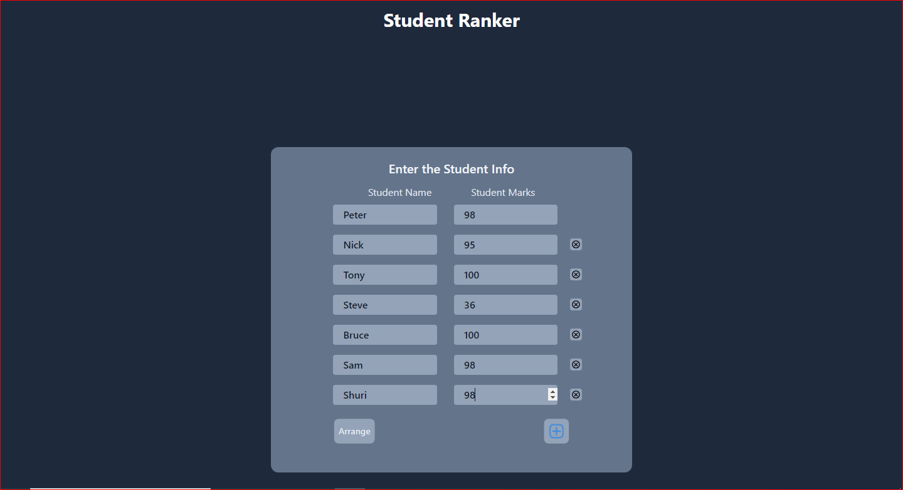
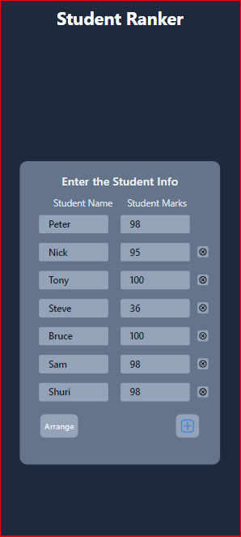
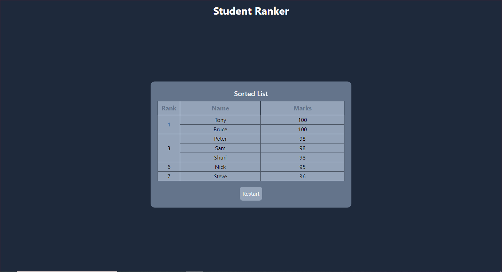
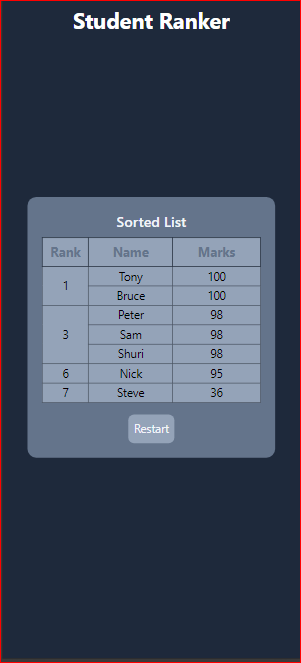

# Student Ranker 🎓

##### Description:

This is my first project to help people. My aunt once asked me to help her in sorting the names of her students based on their marks. She's a teacher, so I thought of making a web app to assist her.

##### Features:

* Sort students by marks
* If students get the same mark, the rank will be shared, and the next rank will be eliminated

##### Technologies Used:

* HTML
* CSS
* JavaScript
* Tailwind CSS
* Figma (for designing the prototype)

##### Setup Instructions:

1. Add student names in any order.
2. Tap the "Add" button to add the next student.
3. At the end, submit to get a sorted student list.

##### Usage:
Open the link to the page: [GitHub Page URL]

##### Contributing:
Feedback is welcome! Please provide your feedback on [GitHub](https://github.com/Rai-shwith).

##### License:
No license.

##### Screenshots:
 
 
 
 

##### Contact Information:

* [Instagram](https://www.instagram.com/ashwith_rai_0404?igsh=Z2Z2cDdyZXA5aGky)
* [Telegram](https://t.me/raiashwith)
* [WhatsApp](https://wa.me/qr/XNYXIBVEI24UK1)